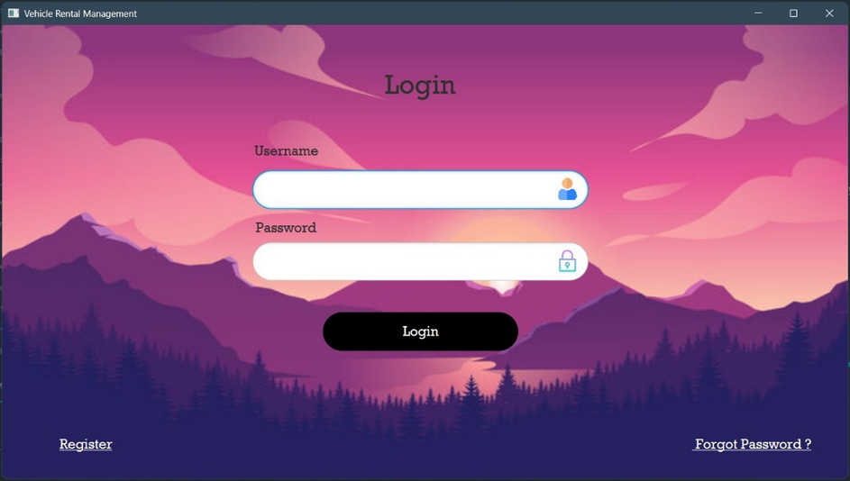
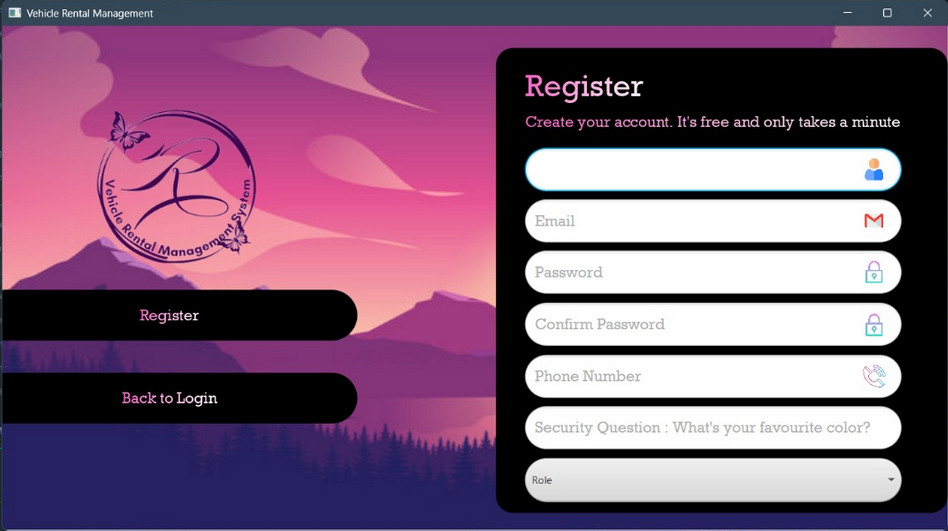
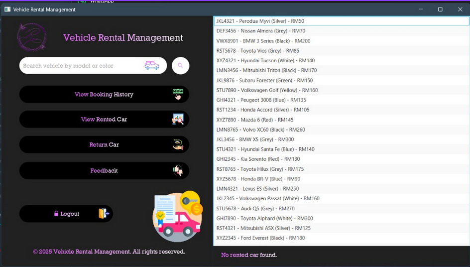

# 🚗 Vehicle Rental Management System
A software application designed to automate and streamline the vehicle rental process. It enables customers to reserve cars, view their rental history, and manage payments — while administrators and vehicle owners manage vehicles, records, and operations.

## 🛠️ Technologies
* Java
* JavaFX
* IntelliJ IDEA Community Edition
* SceneBuilder

## ✨ Features
Here's what you can do with Vehicle Rental Management System:
* Three user roles — Admin, Customer, and Vehicle Owner.
* Admins manage users, handle reports and feedback, and oversee the system.
* Customers can rent vehicles and track their rental history.
* Vehicle owners can rent cars and list their own vehicles for rental.
* Basic fleet, maintenance, and record management functionality.

## 📝 The Process
We began by writing pseudocode to outline the system’s logical flow. This was followed by constructing a UML class diagram to clearly define the classes, attributes, methods, and getter/setter relationships across the application.

Once the system structure was finalized, we moved on to UI planning and implementation. The interfaces were built using JavaFX with SceneBuilder to connect layouts to the underlying application logic. This structured workflow helped us better understand how design, logic, and data interact within a software project.

## 🎓 What I Learned
### 🧩 Object-Oriented Programming (OOP)
* Practical application of the six core OOP principles.
* Cleaner class structures and more maintainable logic.

### 🎨 UI & Tools
* Building UI using JavaFX and SceneBuilder.
* Realizing that tools like Figma can speed up UI design.

### 🔐 System & Security Practices
* Improved exception and error handling.
* Implemented password hashing (text-file database).
* Standardized user data formatting.
* Avoided redundant database structures.

### 🚀 Experience Growth
* Applied lessons learned from my previous project (Fundtastic) to improve architecture and reliability.

## 🚀 How Can It Be Improved?
* Redesign the UI to be more modern, user-friendly, and interactive.
* Make the UI scalable across screen sizes (full-screen, mobile, etc.).
* Replace text-file storage with a properly hosted database.
* Introduce richer analytics and real-time status updates.

## 🖥️ Running the Project
1. Clone the repository to your local machine:
`https://github.com/MaheshV-13/Vehicle-Rental-Management-System.git`
2. Open the project in IntelliJ IDEA Community Edition.
3. Ensure the Java SDK is installed and configured.
4. Build and run the project — the text-file database works locally, so no extra setup is needed.

## 📸 Previews

  
